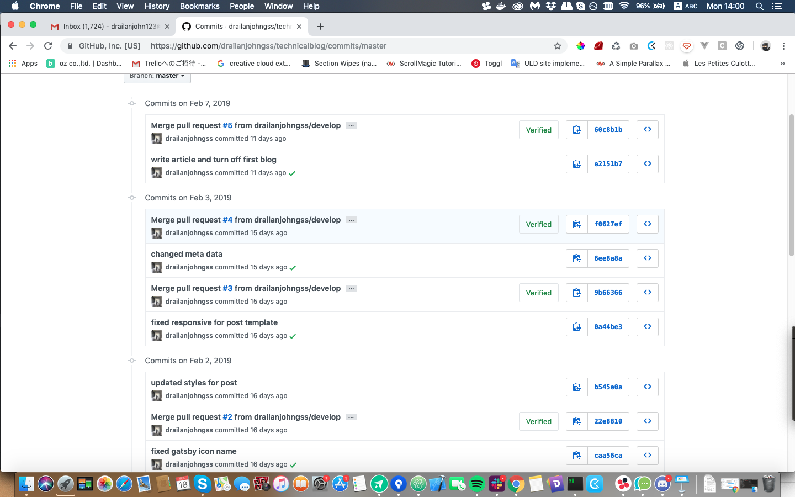
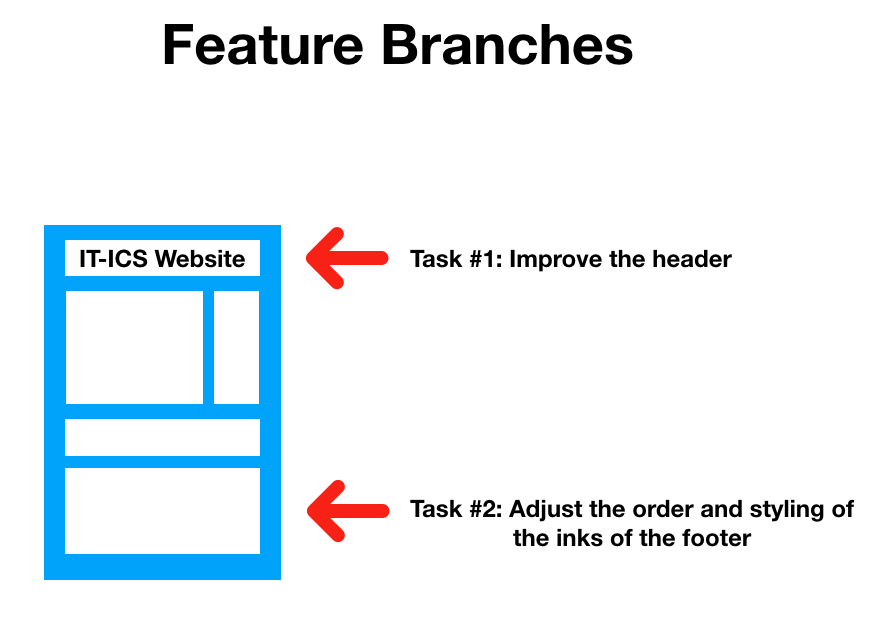
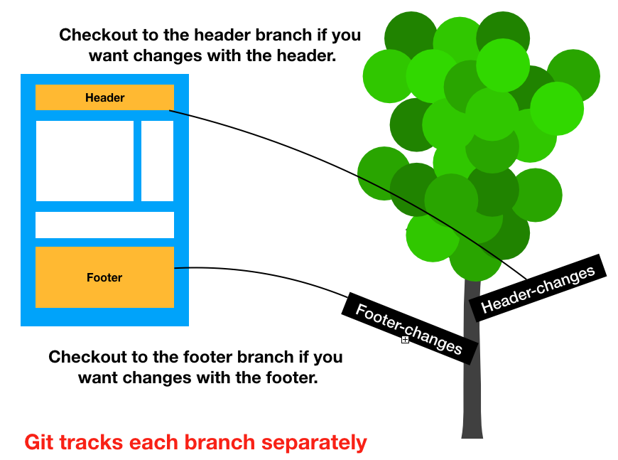
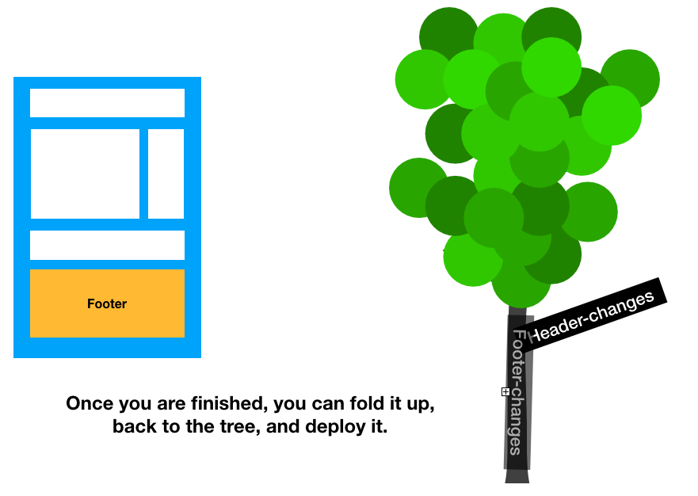

### 3 questions, I will answer in this blog post.
 --------
 - What is Git?
 - Why should we learn Git ?
 - Where do we begin ?

### 1. What is Git ?

  Git basically helps us manage our project files, its a tool that we need to install in our computer. It tracks our changes in these files. Git enables us to have save points. Just like in a game, we can see our save history.

  

  We can go back to these save points (commits), anytime. Isn't this convenient ? Not only that, you can see the person who made these changes, like also the line they modified or deleted.

  ```
  On April 3rd you removed line 4-6 in "banner.css"

  -float: left;
  -padding: 2rem;
  -margin: 2rem;
  ```

  #### Git also solves problems that software development teams encounter when collaborating.

  Let's have an example scenario. Let's say you have a team, and you are creating a research documentation.

  Here's the Scenario
  ```
  Hey buddy, here’s the first chapter and a half, do you mind making few edits and finishing the 2nd chapter? And then sending the attachment back to me?
  ```

  So, while waiting for him to do the edits you are currently stuck, waiting for your friend’s updates.
You noticed some errors, and decided to fix it.

  This results to two different versions of your work. The document you sent to your buddy is not the latest version since you made some modifications on it.

  So then, your buddy has finished your request and now you have a problem how you can merge your work.It's natural to ask your buddy, to manually step by step summarize what they actually change in the document.Someone needs to comb through both copies, find all changes and merge the two.And its also normal, if your buddy says HELL NO!.

  #### Now, here comes Git, git will merge for us. Git is a tool for collaboration and being more productive.

  #### Another, amazing feature of Git is its <u>Feature branches </u>

  

  Let's say you have to implement these features into your site. Task 1 is to improve the header, and the other is do some adjustment in the order and styling of the footer. Normally without git, you will dive in directly by working on either of these tasks, maybe you can ask your other teammate to work on the footer, while you work on the header. Now here's the thing, without git, after finishing your task, and you want it now to be deployed in the production site, you'll have to wait for your buddy to finish the other task, because it's still under construction and it may become broken if you push through the deployment.

  #### But, with Git feature branch

  

  Git, has the capability to create a copy or a different version of your code. This is called a branch. Once you modify this branch its separately tracked, from the parent branch (master) or other branches.


  

  Once you are finished with the feature you are working on you can just push it back to the parent branch (merging). In this way, conflicts will be lessened and you can deploy this feature anytime as soon as its ready.  

  So let's go back to our questions.

  We now learned, what is git, its has three main features, its history, collaboration features and its feature branches.

  Now, next is
  #### Why should we learn Git?

  The answer, is Git is industry standard. Almost all companies are looking for developers who has the basic knowledge of git, because of its collaboration tools and benefits.

  #### Now where do you begin?

  You already began, you have now the basics of Git principles.


  Some Resources for learning Git:

  [Youtube Link](https://www.youtube.com/watch?v=9GKpbI1siow) <br/>
  [Tutorialspoint Git](https://www.tutorialspoint.com/git/git_basic_concepts.htm) <br />
  [Learning by doing](https://try.github.io/)
