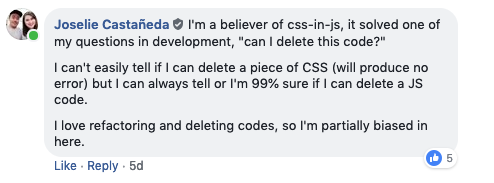
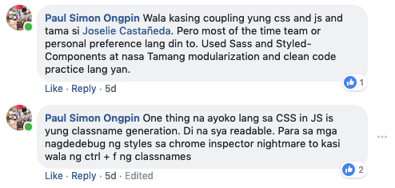

CSS in javascript is a new concept for me. Being a web developer for almost 2 years now, I only knew about CSS and some preprocessors.

But now here's a new technology, silently creeping in like a ghost. Kidding aside, I've been reading stuff about styled-components on freecodecamp and dev.to, and honestly I don't know the true potential of it yet, until I began working for <a href="https://www.facebook.com/OfficialFarmGoat/">Farmgoat</a>. Honestly speaking I haven't yet mastered the basics of it, but I'm having a clear and concise idea on what it does.

Basically, based on my current understanding <a href="https://www.styled-components.com/"> Syled-components</a> is a tool that let's us write components that possesses their own encapsulated styles.

So what does this mean? well for me, the first step to understand what this is, is to let go what you know about writing traditional css. If you have used React before, then basically, it lets you directly create a component which contains style, which you can use across your codebase. This way, mapping between styles and components are eliminated.

When creating styled-components you have to take into consideration that you are not naming classes, but rather directly a component. Names should be taken literally.

My first reaction was, what the effin heck was that? It doesn't make sense, why are we styling directly these component which according to W3C standard way of writing css is to put it in an external css file. There should be  separation of concerns.

But as I've asked my colleagues, office-mates and friends who uses styled-components, I've asked them <b>what styled-components really solves?</b> and in connection to this controversial medium <a href="https://medium.com/@gajus/stop-using-css-in-javascript-for-web-development-fa32fb873dcc?fbclid=IwAR1N6Zk6N1i01nMSGq3qWKztLvmT824eBlHt9mYUronwapP0a4__Rfp7txg">article</a> that I've read.

Here's their top answers:  

  

  

Now It makes sense! Maintaining over 2000+ lines of CSS code is a nightmare, with all those media queries and repetitive codes. It's hard to tell just by looking if its alright to delete this code. That is one awesome thing that styled-components can do, and ofcourse since it's written in JS you can easily pass props, implement themes and layout easily.

So that's it, currently I'm still exploring it, and so far, I'm starting to appreciate its power and capabilities. Now, I'm convinced I'll use styled-components on my future projects.   
